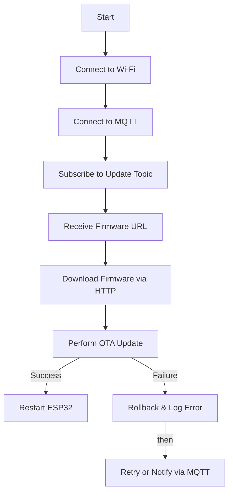

# ESP32 OTA Update with MQTT and HTTP

## Overview
This project implements an Over-the-Air (OTA) update system for ESP32 using MQTT and HTTP. The ESP32 subscribes to an MQTT topic where it receives a firmware URL. It then downloads the firmware via HTTP and updates itself.

## Architecture
- **Wi-Fi Connectivity**: The ESP32 connects to a specified Wi-Fi network.
- **MQTT Communication**: Listens for firmware update URLs via MQTT.
- **HTTP Firmware Download**: Fetches the binary firmware file from an HTTP server.
- **OTA Update Execution**: Performs the firmware update process.
- **Error Handling**: Handles connection failures and rollback mechanisms.

## Modules
1. **OTA_FirmwareUpdates_ESP32-S3**: 
     **.** It handles the WiFi and MQTT connections and their workflow.
     **.** Initialises WiFi& MQTT conncetion at **setup** function.
     **.** Checks the both WiFi and MQTT connection status every second and Reconnects if they lost connection in **non-blocking** way. 
2. **WiFiManager**: 
     **.** Establishes and maintains WiFI connectivity using **wifi_setup** function.
     **.** Also handles Wifi status checking and Reconnection functions.
3. **MQTTClient**: 
     **.** Establishes and maintains MQTT connectivity to **Mosiquitto** server(you can use your custom server).
     **.** MQTT broker subscribes to **ESP32/ota/update** topic to get firmware update request in http link format.
     **.** Puslishes the status messages to the client.
     **.** Also handles MQTT status checking and Reconnection functions.
4. **OTAHandler**:
     **.** Writes the firmware update to the ESP32’s flash memory over HTTP requests on top of MQTT.
     **.** Sends firmware in chuncks.
     **.** Publishes MQTT messages about firmware update status.
5. **network_credentials.h**:
     **.** Contains wifi username & password details (use your credentials).
     **.** And MQTT broker,topic, client names (use your custom credentials).
6. **headers.h**: 
     **.** included all necessary header files.
     **.** Contains **nonblockingtimerdelay()** function definition. 

## Flowchart

## Error Handling
- **Wi-Fi Disconnection**: Reconnects automatically using `WiFi.reconnect()`.
- **MQTT Disconnection**: Implements a non-blocking reconnection mechanism.
- **Firmware Download Failure**: Logs error and notifies via MQTT.
- **OTA Failure**: Rolls back to previous firmware.

