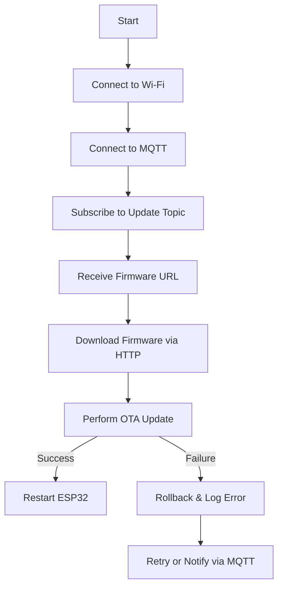

# ESP32 OTA Update with MQTT and HTTP

## Overview
This project implements an Over-the-Air (OTA) update system for ESP32 using MQTT and HTTP. The ESP32 subscribes to an MQTT topic where it receives a firmware URL. It then downloads the firmware via HTTP and updates itself.

## Architecture
- **Wi-Fi Connectivity**: The ESP32 connects to a specified Wi-Fi network.
- **MQTT Communication**: Listens for firmware update URLs via MQTT.
- **HTTP Firmware Download**: Fetches the binary firmware file from an HTTP server.
- **OTA Update Execution**: Performs the firmware update process.
- **Error Handling**: Handles connection failures and rollback mechanisms.

## Modules
1. **Wi-Fi Connection**: Establishes and maintains connectivity.
2. **MQTT Communication**: Connects to the MQTT broker and subscribes to update topics.
3. **Firmware Download**: Fetches the firmware file over HTTP.
4. **OTA Execution**: Writes the firmware update to the ESP32’s flash memory.
5. **Progress Updates**: Publishes update progress to an MQTT topic.
6. **Error Handling**: Detects and logs failures, implements rollback.

## Flowchart

## Error Handling
- **Wi-Fi Disconnection**: Reconnects automatically using `WiFi.reconnect()`.
- **MQTT Disconnection**: Implements a non-blocking reconnection mechanism.
- **Firmware Download Failure**: Logs error and notifies via MQTT.
- **OTA Failure**: Rolls back to previous firmware.

## Future Improvements
- Implementing secure firmware updates with encryption.
- Adding TLS authentication for MQTT and HTTP connections.
- Storing logs in an external memory for debugging.

This document provides an overview of the system design. Developers can refer to the source code and README for further details.

